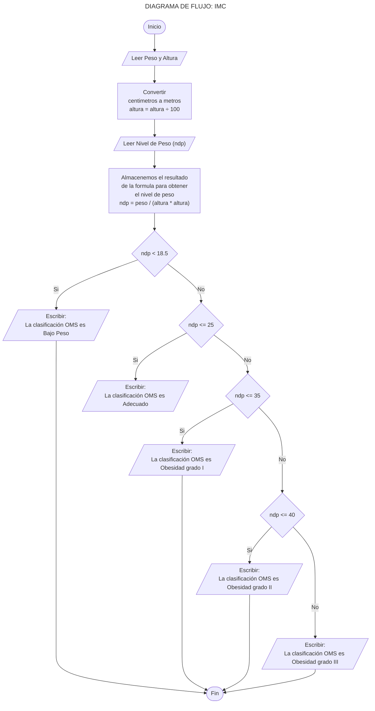

<a href="https://colab.research.google.com/gist/EniDev911/34ea48dd918bf250765bdd8d0c4c8750/sentencias-condicionales-e-iterativas.ipynb" target="_parent"></a>

## Actividad 1 - IMC

El IMC, conocido como el índice de masa corporal, es una medida que asocia el peso de una persona. Este valor es utilizado como un indicador nutricional y constituye un índice fácil y sencillo de calcular para determinar el estado de obesidad y sobrepeso de una persona. El IMC se calcula de la siguiente manera:

<font size=7 color='#ffff5d'>
$IMC=\frac{W}{H^2}$
</font>

Donde:

- `W`: corresponde al peso de la persona en Kg.
- `H`: corresponde a la altura en metros.
- `IMC`: El valor del IMC, en [Kg/m2]

Para ello, la Organización Mundial de la Salud (OMS) ha determinado una clasificación así para distintos rangos de valores:


|IMC|Clasificación OMS|
|:--|:----------------|
|`< 18.5`|Bajo Peso|
|`18.5 - 25`|Adecuado|
|`25 - 30`|Sobrepeso|
|`30 - 35`|Obesidad Grado I|
|`35 - 40`|Obesidad Grado II|
|`> 40`|Obesidad Grado III|


Teniendo claro lo anterior, podemos ahora proceder a desarrollar el código. Sin embargo antes de llegar a escribir el código pasemos a crear el diagrama de flujo:



```python
"""
   - Bajo Peso: < 18.5
   - Adecuado: 18.5 - 25
   - Sobrepeso: 25 - 30
   - Obesidad grado I: 30 - 35
   - Obesidad grado II: 35 - 40
   - Obesidad grado III: Más de 40
"""

peso = float(input("Introduce el peso en Kilogramos: "))
altura = float(input("Introduce la altura en Centimetros: ")) / 100

if peso and altura > 0:


    nivel_de_peso = round(peso / (altura * altura), 2)
    clasificacion = "Su IMC es %s\nLa clasificación OMS es %s"

    if nivel_de_peso <= 18.5:
        print(clasificacion % (nivel_de_peso, "Bajo Peso"))
    elif nivel_de_peso <= 25:
        print(clasificacion % (nivel_de_peso, "Adecuado"))
    elif nivel_de_peso <= 30:
        print(clasificacion % (nivel_de_peso, "Sobrepeso"))
    elif nivel_de_peso <= 35:
        print(clasificacion % (nivel_de_peso, "Obesidad Grado I"))
    elif nivel_de_peso <= 40:
        print(clasificacion % (nivel_de_peso, "Obesidad Grado II"))
    else:
        print(clasificacion % (nivel_de_peso, "Obesidad Grado III"))

else:
    msg = "Los argumentos peso y altura deben ser mayor a 0"
    print(msg + "\nEj: peso: 81, altura: 178")
```

    Introduce el peso en Kilogramos: 0
    Introduce la altura en Centimetros: 4
    Los argumentos peso y altura deben ser mayor a 0
    Ej: peso: 81, altura: 178
    

## Actividad 2 - Cachipún

El **cachipún**, conocido también como **yan ken po**, **how-are-you-speak**, es un juego de manos en el que existen tres elementos:

- **la piedra que vence a la tijera** rompiéndola.
- **la tijera que vence al papel** cortándolo.
- **el papel que vence a la piedra** envolviéndola.

Se utiliza con mucha frecuencia para decidir quién de dos personas hará algo, tal y como se hace a veces usando una moneda.


Se pide crear el programa Python, donde el usuario entregará como argumento: `piedra`, `papel` o `tijera`. Para que el computador pueda jugar escogerá un valor al azar.


```python
import random

opcion_usuario = input("Juega Piedra, Papel o Tijera: ").lower()

if (opcion_usuario == "piedra" or
        opcion_usuario == "papel" or
        opcion_usuario == "tijera"):

    aleatorio = random.randint(1, 3)

    if aleatorio == 1:
        opcion_computador = "piedra"
    elif aleatorio == 2:
        opcion_computador = "papel"
    elif aleatorio == 3:
        opcion_computador = "tijera"

    if opcion_usuario == opcion_computador:
        print(f"Tú haz elegido {opcion_usuario} y el computador {opcion_computador}. Empate")

    elif ((opcion_usuario == "piedra" and opcion_computador == "tijera") or
            (opcion_usuario == "papel" and opcion_computador == "piedra") or
            (opcion_usuario == "tijera" and opcion_computador == "papel")):
        print(f"Tú haz elegido {opcion_usuario} y el computador {opcion_computador}. Ganaste")

    else:
        print(f"Tú haz elegido {opcion_usuario} y el computador {opcion_computador}. Perdiste")

else:
    print("Debes jugar una opción válida.")
    print("Opciones válidas: Piedra, Papel, Tijera.")
    print("Ejemplo: $ python cachipun.py", "tijera")
    exit()
```

    Juega Piedra, Papel o Tijera: piedra
    Tú haz elegido piedra y el computador papel. Perdiste
    
